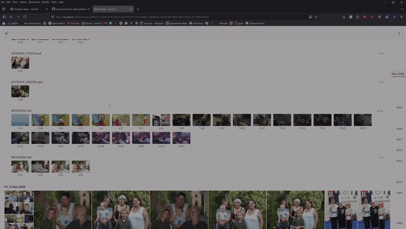
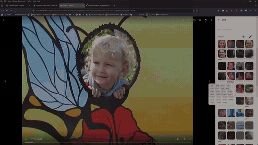
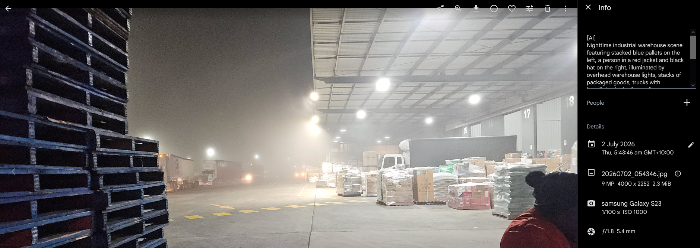

 
   
  
  
   
   

# 🍴 This fork

This is a personal fork of [immich-app/immich](https://github.com/immich-app/immich), kept in sync with
upstream `main`, with two extra capabilities layered on top of a stock install. See
[FORK_CHANGES.md](FORK_CHANGES.md) for the full technical changelog (schema, config, API).

## Facial recognition throughout videos

Stock Immich only runs face detection on a video's first-frame thumbnail — if someone isn't in that
exact frame, they're never recognized anywhere in that video. This fork samples frames throughout the
full video at a configurable rate, runs each through Immich's existing face-detection model, dedupes
repeated detections of the same appearance, and surfaces every distinct moment a person shows up:

- A person's page lists every video they appear in, grouped in its own card with the filename and
  duration, and a frame thumbnail per appearance — hover one for a short preview clip, click to jump
  straight there.
- While watching a video, clicking a person in the sidebar shows their appearance timestamps for
  *that* video in place, without navigating away, and seeks the player when you pick one.
- An in-place edit mode on the People sidebar for quickly renaming or unassigning a face without
  leaving the video.

> [!NOTE]
> **Backfilling an existing library:** if your videos already went through stock Immich's face
> detection before you installed this fork, the regular Face Detection queue's "Missing" button on
> the admin Jobs page won't pick them up for a video-wide scan — it only tracks the first-frame job,
> which those videos have already completed. Use **Admin → Jobs → Create Job → Video face detection**
> instead; it queues the full-video scan for every video and is separate from the regular Face
> Detection queue.

   
  A person's page: every video they appear in, grouped by video, with a hover preview per timestamp.

   
  Watching a video: appearance timestamps for the people in this clip, seeking in place.

## AI-generated photo descriptions via Immich Analyze

Credit for this one goes entirely to **Timofey Klester** ([@timasoft](https://github.com/timasoft)) —
his [immich-analyze](https://github.com/timasoft/immich-analyze) project runs alongside Immich as a
companion container. It analyzes photos with a vision-capable model (via Ollama or a llama.cpp
server) and writes a generated description back into each asset, making the library's existing
metadata search far more useful — you can search for what's actually *in* a photo, not just its
filename, date, or tags. It's not part of this fork's codebase; it's a separate open-source project
I run in front of the same library, and it's genuinely great work — go star it.

   
  An AI-generated description written into a photo's metadata by immich-analyze.

---

<h3 align="center">High performance self-hosted photo and video management solution</h3>
 

 

  <a href="readme_i18n/README_ca_ES.md">Català</a>
  <a href="readme_i18n/README_es_ES.md">Español</a>
  <a href="readme_i18n/README_fr_FR.md">Français</a>
  <a href="readme_i18n/README_it_IT.md">Italiano</a>
  <a href="readme_i18n/README_ja_JP.md">日本語</a>
  <a href="readme_i18n/README_ko_KR.md">한국어</a>
  <a href="readme_i18n/README_de_DE.md">Deutsch</a>
  <a href="readme_i18n/README_nl_NL.md">Nederlands</a>
  <a href="readme_i18n/README_tr_TR.md">Türkçe</a>
  <a href="readme_i18n/README_zh_CN.md">简体中文</a>
  <a href="readme_i18n/README_zh_TW.md">正體中文</a>
  <a href="readme_i18n/README_uk_UA.md">Українська</a>
  <a href="readme_i18n/README_ru_RU.md">Русский</a>
  <a href="readme_i18n/README_pt_BR.md">Português Brasileiro</a>
  <a href="readme_i18n/README_sv_SE.md">Svenska</a>
  <a href="readme_i18n/README_ar_JO.md">العربية</a>
  <a href="readme_i18n/README_vi_VN.md">Tiếng Việt</a>
  <a href="readme_i18n/README_th_TH.md">ภาษาไทย</a>
  <a href="readme_i18n/README_ml_IN.md">മലയാളം</a>

> [!WARNING]
> ⚠️ Always follow [3-2-1](https://www.backblaze.com/blog/the-3-2-1-backup-strategy/) backup plan for your precious photos and videos!
> 
 

> [!NOTE]
> You can find the main documentation, including installation guides, at https://immich.app/.

## Links

- [Documentation](https://docs.immich.app/)
- [About](https://docs.immich.app/overview/introduction)
- [Installation](https://docs.immich.app/install/requirements)
- [Roadmap](https://immich.app/roadmap)
- [Demo](#demo)
- [Features](#features)
- [Translations](https://docs.immich.app/developer/translations)
- [Contributing](https://docs.immich.app/overview/support-the-project)

## Demo

Access the demo [here](https://demo.immich.app). For the mobile app, you can use `https://demo.immich.app` for the `Server Endpoint URL`.

### Login credentials

| Email           | Password |
| --------------- | -------- |
| demo@immich.app | demo     |

## Features

| Features                                     | Mobile | Web |
| :------------------------------------------- | ------ | --- |
| Upload and view videos and photos            | Yes    | Yes |
| Auto backup when the app is opened           | Yes    | N/A |
| Prevent duplication of assets                | Yes    | Yes |
| Selective album(s) for backup                | Yes    | N/A |
| Download photos and videos to local device   | Yes    | Yes |
| Multi-user support                           | Yes    | Yes |
| Album and Shared albums                      | Yes    | Yes |
| Scrubbable/draggable scrollbar               | Yes    | Yes |
| Support raw formats                          | Yes    | Yes |
| Metadata view (EXIF, map)                    | Yes    | Yes |
| Search by metadata, objects, faces, and CLIP | Yes    | Yes |
| Administrative functions (user management)   | No     | Yes |
| Background backup                            | Yes    | N/A |
| Virtual scroll                               | Yes    | Yes |
| OAuth support                                | Yes    | Yes |
| API Keys                                     | N/A    | Yes |
| LivePhoto/MotionPhoto backup and playback    | Yes    | Yes |
| Support 360 degree image display             | No     | Yes |
| User-defined storage structure               | Yes    | Yes |
| Public Sharing                               | Yes    | Yes |
| Archive and Favorites                        | Yes    | Yes |
| Global Map                                   | Yes    | Yes |
| Partner Sharing                              | Yes    | Yes |
| Facial recognition and clustering            | Yes    | Yes |
| Memories (x years ago)                       | Yes    | Yes |
| Offline support                              | Yes    | No  |
| Read-only gallery                            | Yes    | Yes |
| Stacked Photos                               | Yes    | Yes |
| Tags                                         | No     | Yes |
| Folder View                                  | Yes    | Yes |

## Translations

Read more about translations [here](https://docs.immich.app/developer/translations).

## Repository activity

## Star history

<a href="https://star-history.com/#immich-app/immich&type=date&legend=top-left">
 <picture>
   <source media="(prefers-color-scheme: dark)" srcset="https://api.star-history.com/svg?repos=immich-app/immich&type=date&theme=dark" />
   <source media="(prefers-color-scheme: light)" srcset="https://api.star-history.com/svg?repos=immich-app/immich&type=date" />
   
 </picture>
</a>

## Contributors

