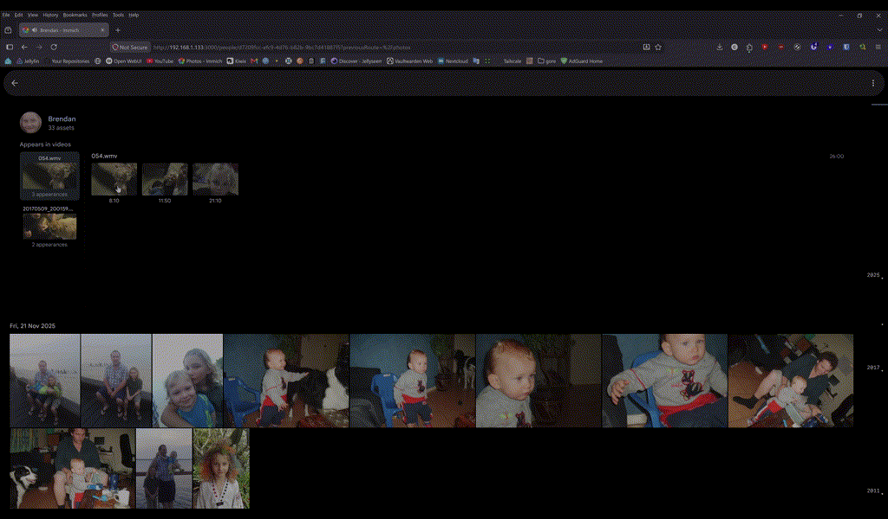
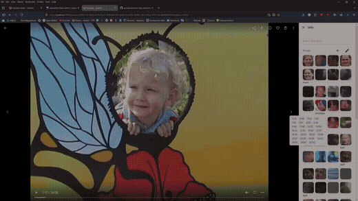
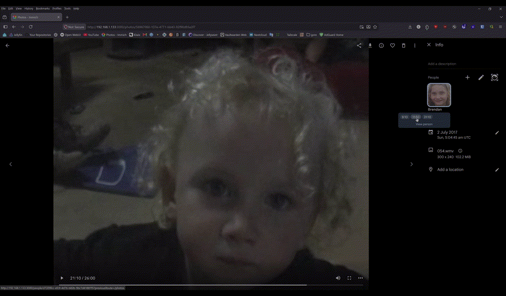
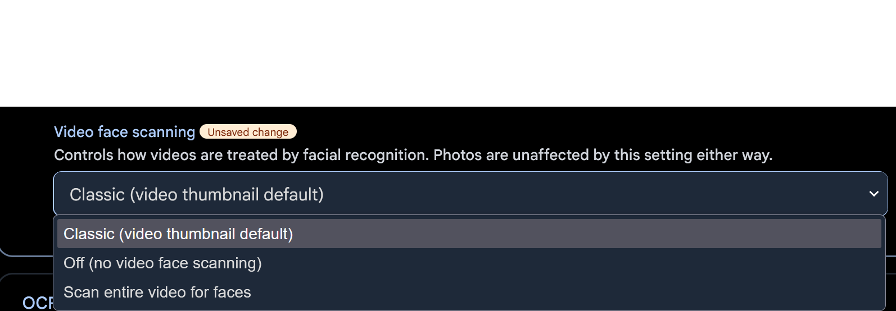
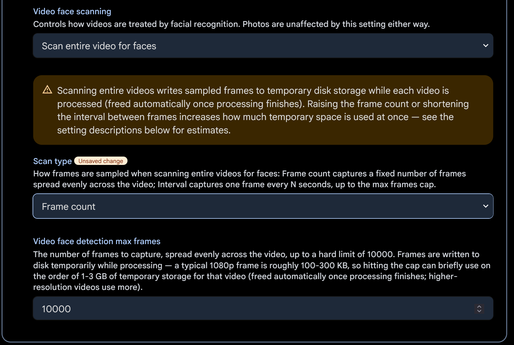
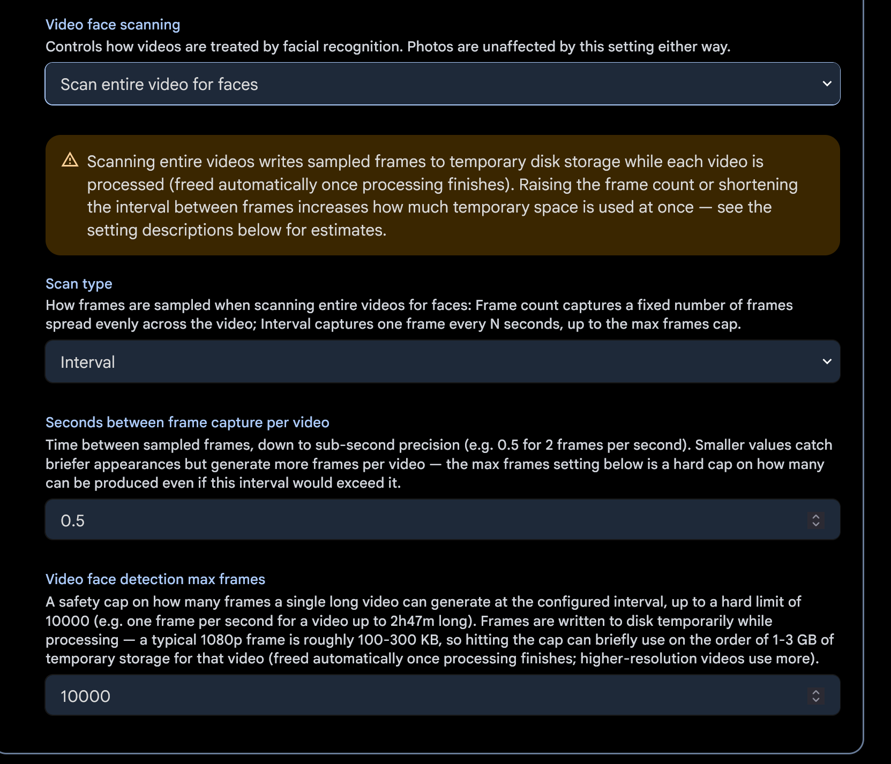
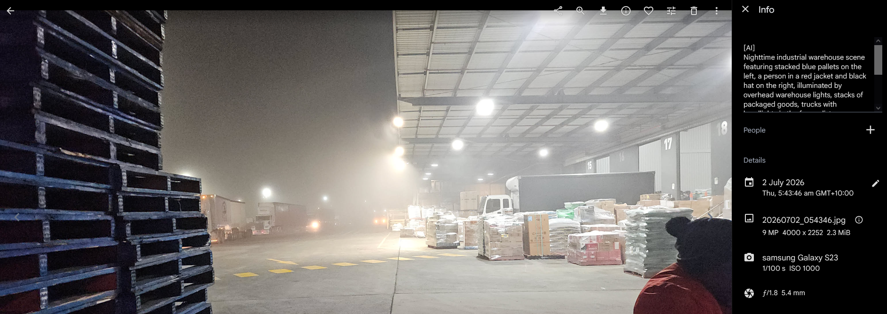

<p align="center"> 
  <br/>
  <a href="https://opensource.org/license/agpl-v3"></a>
  <a href="https://discord.immich.app">
    
  </a>
  <br/>
  <br/>
</p>

# 🍴 This fork

This is a personal fork of [immich-app/immich](https://github.com/immich-app/immich), kept in sync with
upstream (currently **v3.2.1**), with a few extra capabilities layered on top of a stock install:

- [Facial recognition throughout videos](#facial-recognition-throughout-videos)
- [A Browse page](#browse-page) with one-click filtering and sorting
- [Video subtitles](#video-subtitles): English subtitles for videos in any spoken language

See [FORK_CHANGES.md](FORK_CHANGES.md) for the full technical changelog (schema, config, API).

****************************************************************************************************************************************************************************************
Warning, probably buggy and unstable, changes made with claude code and should not be trusted with any library your not comfortable restoring from scratch if this fork breaks something
****************************************************************************************************************************************************************************************


## Facial recognition throughout videos

Stock Immich only runs face detection on a video's first-frame thumbnail — if someone isn't in that
exact frame, they're never recognized anywhere in that video. This fork adds a second, **opt-in**
pass that samples frames throughout the full video at a configurable rate, runs each through
Immich's existing face-detection model, groups the video's detections into the people they show,
and surfaces every distinct moment a person shows up.

Every detection is kept. Faces are linked frame to frame, so one person stays one person as they
turn their head, and they're rejoined after a cut; each group is then recognised once against the
rest of your library.

The detection/clustering approach here is adapted closely from
[Tom Holland](https://github.com/0thomasholland)'s
[`feature/video-face-phase-5`](https://github.com/0thomasholland/immich/tree/feature/video-face-phase-5)
branch — thank you, Tom, for the original design. Several real bugs shared with that lineage were
caught by [IAfanasov](https://github.com/IAfanasov)'s independent review on the original
[GitHub discussion](https://github.com/immich-app/immich/discussions/5936); see
[FORK_CHANGES.md](FORK_CHANGES.md#credit) for the full credit and bug list.

- **Opt-in, configurable scanning** (Admin → Machine Learning → Facial Recognition): a three-way
  mode — off, classic first-frame-only (stock behavior), or full video scan — so installing this
  fork never silently starts reprocessing an existing library. Full-scan users pick an evenly-spread
  frame count or a seconds-between-frames interval (sub-second precision), capped at 10,000 frames
  per video, with disk-space guidance in the settings UI.
- **Manual per-video scan**: a "Scan video for faces" button next to the People section on any video
  (admin only, shown only when video scanning is enabled) — (re-)scan a single file without waiting
  for or re-running the library-wide job.
- **A person's page** lists every video they appear in as a two-pane, file-explorer-style view: a
  scrollable video list on the left — thumbnail plus appearance count, sorted so the video most
  worth checking is always on top — and a larger pane on the right showing a real frame thumbnail
  per timestamp in the selected video, hover-swappable to a short clip preview.
- **While watching a video**, clicking a person in the sidebar floats a popover with that person's
  appearance timestamps *in this video* — seeking the player in place when you pick one — plus a
  "View person" link straight to their page.
- **An in-place edit mode** on the People sidebar: inline rename and "not a face" buttons on hover,
  a "Merge people" picker, and a dedicated "Wrong person" action that opens a picker of candidate
  people ranked by face-embedding similarity, so you reassign just the one misidentified face
  without merging the two people's other photos and videos together.
- **"This person is not in this video"**: one click detaches a wrongly recognised person from every
  face they're tagged in within that video, instead of removing appearances one at a time.
- **Person page menu**: "Delete person and reset faces" for people that turned into a mess of
  misgrouped faces after repeated scans — unassigns (doesn't delete) their faces so the next
  Facial Recognition run reconsiders them from scratch.

> [!NOTE]
> **Enabling on an existing library:** video face scanning is off by default — turn it on under
> Admin → Machine Learning → Facial Recognition first. Once enabled, the regular Face Detection
> queue's "Missing" button on the admin Jobs page won't pick up already-processed videos for a
> video-wide scan — it only tracks the first-frame job. Video face detection has its own row on the
> **Admin → Job Queues** page with its own **All**/**Missing** buttons — use **All** once to backfill
> your existing library, or use the per-video "Scan video for faces" button to backfill one file at
> a time.
>
> **Already scanned videos with a build from before 2026-09-15?** Those builds deleted near-duplicate
> faces, which could split one person into dozens of one-face "people" that never show on the People
> page. Run **Video face detection → All** once to regroup them.

<p align="center">
  <br/>
  <sub>A person's page: every video they appear in, master/detail style, with a hover clip preview per timestamp.</sub>
</p>
<p align="center">
  <br/>
  <sub>Watching a video: browsing people and their appearance timestamps from the info sidebar.</sub>
</p>
<p align="center">
  <br/>
  <sub>The "View person" link: jump from an appearance timestamp straight to that person's page.</sub>
</p>
<p align="center">
  <br/>
  <sub>Edit mode on the People sidebar: rename, not-a-face, merge, and "Wrong person" reassignment buttons.</sub>
</p>
<p align="center">
  <br/>
  <sub>Admin settings: the opt-in scan-mode dropdown — Classic, Off, or full video scan.</sub>
</p>
<p align="center">
  
  <br/>
  <sub>Full-scan sampling options: an evenly-spread frame count, or a seconds-between-frames interval.</sub>
</p>

## Browse page

The timeline always shows your library newest first. **Browse** (in the sidebar, under Photos) is a
flat grid for everything else:

- **All / Photos / Videos** with one click
- **Sort by** date taken, file size, resolution, duration or filename, ascending or descending, again
  with one click
- Your choices are remembered, and selection and the usual bulk actions work as on the timeline

It shows exactly what the timeline does: nothing archived, locked or in the trash, and partners' photos
when they're shared into your timeline.

## Video subtitles

Videos can get **English subtitles, whatever language is spoken**, generated in the background by
[Whisper](https://github.com/SYSTRAN/faster-whisper) like face detection. Speech that's already English is
simply transcribed.

- **Off by default** — it's heavy CPU work. Turn it on under **Admin → Machine Learning → Video
  subtitles** and pick a model: **Medium** (faster, the default) or **Large-v3** (roughly 2–3x slower,
  better on harder languages and noisy audio).
- Process existing videos from **Admin → Job Queues → Video subtitles** (**Missing** or **All**); new
  uploads are handled automatically. A single video can be (re)done from its menu → **Generate subtitles**.
- In the player, a captions button appears once a video has subtitles. Lines are timed from the spoken
  words, so they end when the speaker stops, and they're split into readable chunks.
- Only multilingual Whisper models are offered, because the "turbo" variants silently skip the
  translation and output the original language.

## AI-generated photo descriptions via Immich Analyze

Credit for this one goes entirely to **Timofey Klester** ([@timasoft](https://github.com/timasoft)) —
his [immich-analyze](https://github.com/timasoft/immich-analyze) project runs alongside Immich as a
companion container. It analyzes photos with a vision-capable model (via Ollama or a llama.cpp
server) and writes a generated description back into each asset, making the library's existing
metadata search far more useful — you can search for what's actually *in* a photo, not just its
filename, date, or tags. It's not part of this fork's codebase; it's a separate open-source project
I run in front of the same library, and it's genuinely great work — go star it.

<p align="center">
  <br/>
  <sub>An AI-generated description written into a photo's metadata by immich-analyze.</sub>
</p>

---

## ⚠️ Disclaimer: this is not the official Immich

This is an **unofficial, customised version** of [Immich](https://github.com/immich-app/immich), made and
maintained by one person. It is **not** the official Immich app, and it is not affiliated with or endorsed
by the Immich team.

- **Please don't ask the Immich team for help with it.** Report problems with this version
  [here](https://github.com/ssjrocks/immich/issues) instead.
- **If you want something stable and supported, use the official Immich:** <https://immich.app>
- The official Immich phone apps work with this server, but they don't show this version's extra features.
- Like Immich itself, it's licensed under the [AGPL-3.0](LICENSE).

## Installing

This version is installed by building it from this repository with Docker. It doesn't use the official
Immich downloads, because those don't include its changes.

**You'll need:**

- A computer that stays on: Linux works best; Windows and macOS work with Docker Desktop
- [Docker](https://docs.docker.com/get-docker/) with Docker Compose, and [Git](https://git-scm.com/downloads)
- At least 6 GB of RAM (8 GB or more if you use video subtitles), and about 20 GB of free disk space for
  the install, plus room for your photos and videos
- An internet connection: the first build downloads a lot, and each machine-learning feature downloads its
  model the first time it's used

**Install it with one command:**

```bash
curl -fsSL https://raw.githubusercontent.com/ssjrocks/immich/main/install.sh | bash
```

(no `curl`? use `wget -qO- https://raw.githubusercontent.com/ssjrocks/immich/main/install.sh | bash`)

That makes an `immich` folder in the current directory, writes the settings with a randomly generated
database password, downloads the ready-built images, starts everything, and prints the address to open —
usually <http://localhost:2283>. Create your admin account there and you're done.

Options, if you want them: `--dir /path/to/folder`, `--port 3000`, `--version v3.2.1-fork.1`. For example:

```bash
curl -fsSL https://raw.githubusercontent.com/ssjrocks/immich/main/install.sh | bash -s -- --dir /srv/immich
```

Afterwards, from that folder: `docker compose stop` to stop it, `docker compose start` to start it again,
and `docker compose pull && docker compose up -d` to update.

<details>
<summary>Prefer to do it by hand, or build from source?</summary>

Installing by hand: download
[`docker-compose.release.yml`](docker/docker-compose.release.yml) and
[`example.fork.env`](docker/example.fork.env) into an empty folder, rename the env file to `.env` and edit
the storage locations and password, then run `docker compose -f docker-compose.release.yml up -d`.

Building the images yourself instead of using the published ones:

```bash
git clone https://github.com/ssjrocks/immich.git && cd immich/docker
cp example.env .env   # then edit it
docker compose -f docker-compose.fork.yml up -d --build
```

The first build takes half an hour or more.

</details>

For everything else (backups, storage, phone apps), the official
[Immich documentation](https://docs.immich.app/) applies.

### No internet on the machine?

There's a **fully offline build** for machines with no connection at all: one command on a computer that
has internet produces a folder you copy across, carrying Docker, the images and every model, so the offline
machine downloads nothing. See [portable/README.md](portable/README.md).

## Turning on this version's features

The video features are **off by default**, because processing a whole library of video takes a lot of
computer time.

| Feature | Where to turn it on | Then |
| --- | --- | --- |
| Faces throughout videos | Administration → Settings → Machine Learning → Facial Recognition → **Video face scanning** → _Scan entire video for faces_ | Administration → Job Queues → **Video face detection** → **All** |
| Video subtitles | Administration → Settings → Machine Learning → **Video subtitles** → enable, and pick a model | Administration → Job Queues → **Video subtitles** → **Missing** |
| Browse page | Always on | **Browse** in the sidebar, under Photos |

New uploads are handled automatically once a feature is on.

## Updating

**Back up first** ([how to back up Immich](https://docs.immich.app/administration/backup-and-restore)).
Updates can change the database, and those changes can't be undone.

```bash
cd immich/docker
```

```bash
git pull
```

```bash
docker compose -f docker-compose.fork.yml up -d --build
```

## Moving between this version and the official Immich

- **Use this version for a new library.** Pointing it at a library created by the official Immich isn't
  supported: this version adds its own database changes, and the server refuses to start when they don't
  fit the history of an existing official database.
- **Going back to the official Immich isn't supported either.** The official server refuses to start on a
  database with this version's changes. Keep backups from before you started if you might want to go back.
